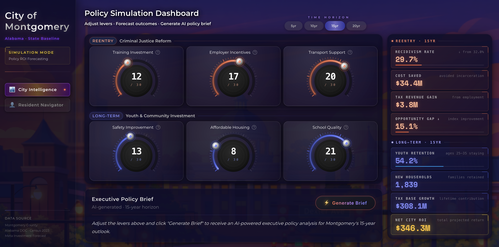
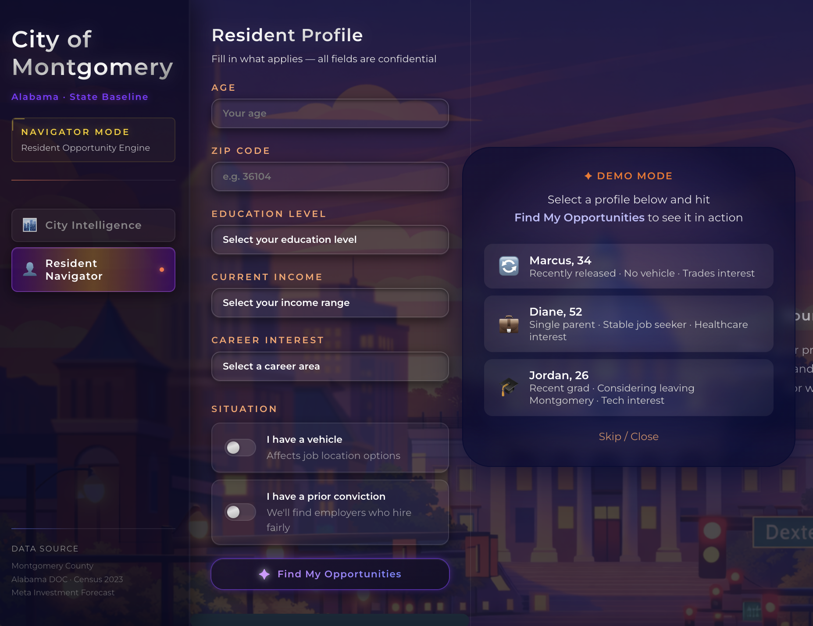

<p align="left">
  
  
</p>

# Montgomery Pathways 🏙️

> *Cities grow. And when they do, some people move forward — and some get left further behind.*
> *Montgomery Pathways exists to close that gap, from both sides at once.*

**AI-powered civic intelligence platform for Montgomery, Alabama.**
Built for the WorldWide Vibe Hackathon 2026 — solo🐱

[](https://montgomerypathways.vercel.app/dashboard)

---

## 🌐 Live Demo

**[montgomerypathways.vercel.app/dashboard](https://montgomerypathways.vercel.app/dashboard)**

Three demo profiles are ready to go — no setup needed:
- **Marcus, 34** — Recently released, no vehicle, skilled trades interest
- **Diane, 52** — Single parent, stable job seeker, healthcare
- **Jordan, 26** — Recent grad, considering leaving Montgomery, tech interest

---

## What It Does

Montgomery Pathways is a dual-interface platform designed around one belief: **sustainable city growth only works when both sides of the equation move forward together.**

### 🏛️ City Intelligence Simulator
A policy ROI forecasting tool for city planners and decision makers.

- Adjust **6 policy levers**: Training Investment, Employer Incentives, Transport Support, Safety Improvement, Affordable Housing, School Quality
- Forecast outcomes across **4 time horizons**: 5 / 10 / 15 / 20 years
- Metrics include: Recidivism Rate, Cost Saved, Tax Revenue Gain, Youth Retention, New Households, Net City ROI
- Generate an **AI Executive Policy Brief** powered by Gemini 2.5 Flash, grounded in live Montgomery data

### 🧭 Resident Navigator
A personalized opportunity engine for residents — and for the case workers and social workers who support them.

- Enter a resident profile: age, ZIP, education, income, career interest, situation
- Conviction-aware: finds employers with **Ban-the-Box policies** in Montgomery
- Returns a **top career match** with real wage data, realistic timeline, and reduced recidivism risk
- Generates a personalized **8-week action plan** with real phone numbers — not generic web links

---

## Architecture

```
┌─────────────────────────────────────────────────────┐
│                   DATA LAYER                        │
│  Bright Data Web Unlocker → brightdata.py           │
│  scrape-baselines.ts → simulation-constants.ts      │
│  (auto-generated from live job postings,            │
│   housing data, employer Ban-the-Box stances)       │
└──────────────────┬──────────────────────────────────┘
                   │
┌──────────────────▼──────────────────────────────────┐
│                   API LAYER                         │
│  FastAPI (Python) — deployed on Railway             │
│  routers/ → generate_brief.py, navigator.py         │
│  schemas/ → Pydantic validation                     │
│  services/ → ai_provider.py, brightdata.py          │
│  Fallback handling on every endpoint                │
└──────────────────┬──────────────────────────────────┘
                   │
┌──────────────────▼──────────────────────────────────┐
│                   AI LAYER                          │
│  Gemini 2.5 Flash                                   │
│  Context-rich prompts include live Montgomery data  │
│  Generates: Executive Policy Briefs                 │
│             8-week Resident Action Plans            │
└──────────────────┬──────────────────────────────────┘
                   │
┌──────────────────▼──────────────────────────────────┐
│                   UI LAYER                          │
│  Next.js — deployed on Vercel                       │
│  Custom CircularGauge UI (GaugePanel.tsx)           │
│  Real-time simulation hooks (useSimulation.ts)      │
│  Demo profile bar (DemoProfileBar.tsx)              │
└─────────────────────────────────────────────────────┘
```

**Official Data Sources:**
- City of Montgomery Open Data
- U.S. Census ACS 5-Year
- BLS Occupational Employment Data
- HUD Fair Housing Data
- Alabama DOC Recidivism Statistics
- Meta Investment Forecast (Montgomery)

---

## Bright Data Integration

This project uses **Bright Data Web Unlocker** for live data scraping — and it's central to what makes this platform real, not a prototype.

### What gets scraped
- Local job postings in Montgomery (wages, requirements, employer stances)
- Employer Ban-the-Box policy status
- Housing availability and cost data
- Baseline economic indicators

### How it works
```
scrape-baselines.ts  →  Bright Data Web Unlocker
                     →  Raw data
                     →  simulation-constants.ts (auto-generated)
                     →  Powers all simulation calculations
```

The key insight: **`simulation-constants.ts` is not hardcoded.** It is generated from scraped live data. Every time baselines are refreshed, the simulation reflects the real Montgomery — not assumptions.

### Backend service
```python
# backend/services/brightdata.py
# Handles Web Unlocker requests with fallback handling
```

---

## Tech Stack

| Layer | Technology |
|-------|-----------|
| Frontend | Next.js (TypeScript) |
| Backend | FastAPI (Python) |
| AI | Gemini 2.5 Flash |
| Data Scraping | Bright Data Web Unlocker |
| Frontend Deploy | Vercel |
| Backend Deploy | Railway |
| Data Sources | Census API, BLS, HUD |

---

## Setup & Installation

### Prerequisites
- Node.js 18+
- Python 3.11+
- Bright Data account (Web Unlocker)
- Google AI Studio API key (Gemini)

### 1. Clone the repository
```bash
git clone https://github.com/yourusername/montgomerypathways_v2.git
cd montgomerypathways_v2
```

### 2. Backend setup
```bash
cd backend
python -m venv .venv
source .venv/bin/activate  # Windows: .venv\Scripts\activate
pip install -r requirements.txt
```

Create `backend/.env`:
```env
GEMINI_API_KEY=your_gemini_api_key
BRIGHTDATA_API_KEY=your_brightdata_api_key
BRIGHTDATA_ZONE=your_zone_name
```

Start the backend:
```bash
uvicorn main:app --reload
```

### 3. Frontend setup
```bash
cd frontend
npm install
```

Create `frontend/.env.local`:
```env
NEXT_PUBLIC_API_URL=http://localhost:8000
```

Start the frontend:
```bash
npm run dev
```

### 4. (Optional) Refresh scraped baselines
```bash
cd frontend
npx ts-node services/engine/scrape-baselines.ts
```

This regenerates `simulation-constants.ts` from live Bright Data scraping.
Without a `BRIGHTDATA_API_TOKEN`, the app uses `data/cache.json` automatically.

---

## Project Structure

```
montgomerypathways_v2/
├── backend/
│   ├── routers/
│   │   ├── generate_brief.py    # Policy brief generation
│   │   └── navigator.py         # Resident opportunity engine
│   ├── schemas/
│   │   └── navigator.py         # Pydantic models
│   ├── services/
│   │   ├── ai_provider.py       # Gemini integration
│   │   ├── brightdata.py        # Bright Data Web Unlocker
│   │   └── navigator.py         # Business logic
│   └── main.py
├── frontend/
│   ├── app/
│   │   ├── dashboard/           # City Intelligence Simulator
│   │   └── navigator/           # Resident Navigator
│   ├── components/
│   │   ├── dashboard/           # GaugePanel, MetricsColumn, PolicyBrief
│   │   ├── navigator/           # DemoProfileBar
│   │   └── ui/                  # CircularGauge
│   ├── hooks/
│   │   ├── useSimulation.ts
│   │   ├── useNavigator.ts
│   │   └── usePolicyBrief.ts
│   └── services/engine/
│       ├── simulator.ts
│       ├── simulation-constants.ts   # Auto-generated via Bright Data
│       └── scrape-baselines.ts
```

---

## The Philosophy Behind This

Before writing a single line of code, I spent time researching Montgomery's real data, talking with city officials, mentors, and residents. One question guided every design decision:

**How do you build a system that shows difficult truths — without crushing hope?**

The answer was two tools, intentionally in the same platform. Because the city and its residents are part of the same equation. And sustainable growth only works when both sides can see the full picture.

---

## Built By

**Me** — Solo submission
🐱 **Nioh** — Cat, co-pilot, present for every single commit

*GenAI Works WorldWide Vibe Hackathon 2026 — Sponsored by City of Montgomery, Alabama, Bright Data*

---

## License

MIT License — see [LICENSE](./LICENSE) for details.